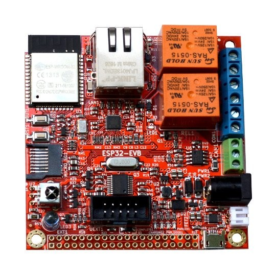

# modbus-to-mqtt
Software for Olimex ESP32-EVB board to read MODBUS registers from a device and send the values to a MQTT broker online

# Description
This project aim to create a MODBUS-MQTT converter that can read data from Modbus registers from a device (ex. a PLC) and transmit the values to a MQTT broker online.
The firmware has been written for the [Olimex ESP32-EVB board](https://www.olimex.com/Products/IoT/ESP32/ESP32-EVB/open-source-hardware):

The board has Wi-Fi, Ethernet, BLE, CAN bus connectivity and an on-board SD MMC card reader slot. The firmware can be modified to fit other ESP32 boards available on the market.

# Operation
The firmware read the Modbus registers configuration that contains all the addresses and types of the Modbus registers to be readed, from a file called registers.txt that can be present inside an SD card put on the board SD MMC slot. If the firmware can't find the file or if there is no SD card on the MMC slot, it try to connect to a specific server online, using the Wi-Fi connection, to download the configuration file.
When the configuration file has been found and correctly parsed, the firmware try to connect to an online MQTT broker and then, if succeded, it try to read all the Modbus registers specified on the config file and transmits their values to a topic on the MQTT broker.

#TODO
  * Implementing the write functions to the Modbus library so when receiving data to a specific topic on the MQTT broker, this can be writed to the relative Modbus register.

  * Finish the BLE configuration part so that all the configuration data of the board (IP addresses, ports etc.) can be set via a BLE device like a smartphone.
  
  * Write a Web App with WebBluetooth API to read and write the board configurations
  
  * If there is space on program memory of the ESP32 board, implementing even an OPC-UA to MQTT converter